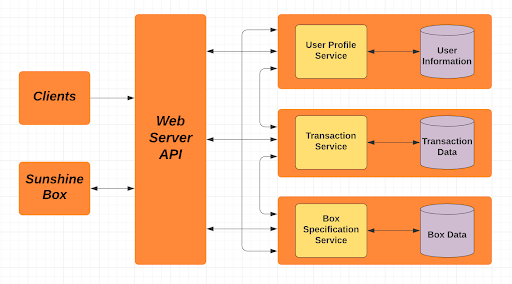

<<<<<<< HEAD
# README

This README would normally document whatever steps are necessary to get the
application up and running.

Things you may want to cover:

* Ruby version

* System dependencies

* Configuration

* Database creation

* Database initialization

* How to run the test suite

* Services (job queues, cache servers, search engines, etc.)

* Deployment instructions

* ...
=======
<<<<<<< HEAD
hi, testing to see if my new laptop is configured
=======
# CS6-Sunshine Box
>>>>>>> 61474b11ea60accea4d158b7f9f0e0fe299ffa70
>>>>>>> 214fefee104b321573908471ba40c1beb6c521ed

# Problem Statement
Sunshine Box is a for profit company that provides developing countries with portable, solar-powered cell phone charging stations. Users pay agents who are owners of the box for charging time. The transactions that occur between a customer and a Sunshine Box are done completely through  text. A customer texts an agent the amount they would like to pay and the agent charges their cell phone for a certain amount of time. Our client tasked us with implementing  an application that makes it easier for her, agents, and customers to  manage, capture, and display data of the transactions between the box and customers in order to clearly show the income that each box is making. We were also tasked with implementing a way for Sunshine Box users to create an account (via text message/the web etc.) that allows them to deposit money and visualize records of their transaction history between Sunshine Boxes.

# Problem Context
Sunshine Box is determined in providing environmentally safe and affordable electricity to those in need of it. In countries such as Haiti, where laptops and computers are often impractical, a cell phone is usually the only way to do essential tasks like monitoring breaking weather conditions, staying informed on current events, conducting online banking or staying in touch with distant family. Currently 80% of Haitians have cell phones, but only 12% have access to electricity. Without a source of electricity, it becomes impossible to charge and use a cell phone, depriving a majority of citizens in Haiti the ability to access the internet and communicate via telecommerce. The Sunshine Box is a solution to this problem, as it serves as a lifeline to important functions, allowing the people who use it to stay connected. Since the Sunshine Box is solar powered it can be used at any time during the day and can be made available to anyone who wishes to use it. As of right now, all payments to the Sunshine Box are done upfront, which puts customers and agents at risk of being robbed. Implementing a web application which allows customers and agents to carry out these transactions will not only make it easier to use the Sunshine Box, but also safer.

# Software Architecture

